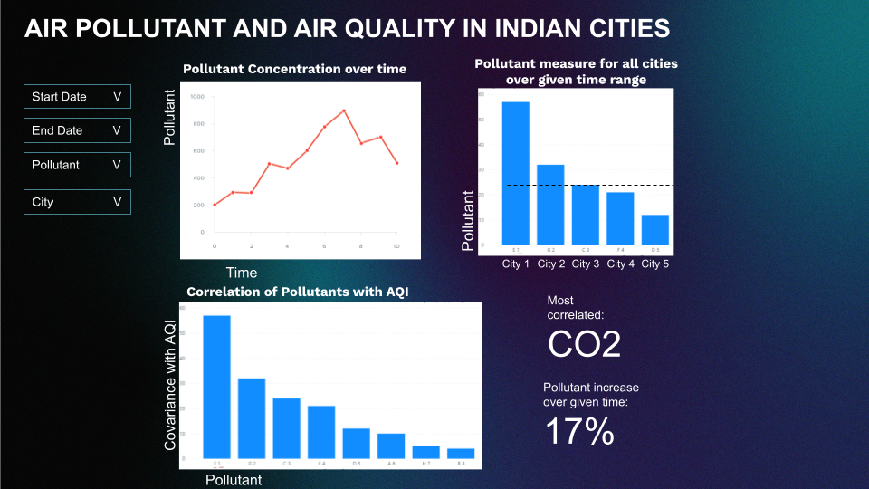

# Motivation and purpose

The primary target audience for the Air Quality Dashboard is environmental researchers, including those based in India studying or monitoring air pollution trends and patterns. Air pollution is a significant public health concern in India, with pollutants such as PM2.5, PM10, NO2, SO2, and CO contributing to potential respiratory diseases, environmental degradation, and threats to biodiversity.

Despite the availability of air quality data, there remains a gap in analytical tools that enable researchers to conduct in-depth explorations of pollution trends, regional comparisons, and temporal patterns. This dashboard addresses this gap by providing visualizations and analytical tools designed specifically for research and policy analysis.

This dashboard provides user-friendly visualizations to help environmental researchers track air quality trends, including AQI and other pollution metrics, from 2015 to 2024. By providing research-focused visualizations, detailed pollutant correlations, and comparative city-level analysis, the dashboard supports in-depth investigations into air quality patterns. It empowers researchers to track changes over time, understand pollutant contributions to AQI, and generate evidence-based insights to inform public health policies and environmental interventions.

# Description of the data

The dataset we're using contains air quality information for 5 cities in India over the span of 10 years. The data itself is taken daily (~20,000 rows). In addition to AQI the dataset also includes measurements for various air pollutants over the same time frame.

Using this data we plan to create an informative and easy to understand dashboard that will show the fluctuations in the air quality of the 5 cities over time. By doing this, we hope to assist researchers gain valuable insights into the various conditions affecting air quality around India. We also plan on deriving the cumulative change over the user's specified time period in the various gases and AQI allowing users to see if there’s been an overall increase or decrease.

# Research questions and usage scenarios

This dashboard is designed for researchers analyzing air pollution trends and their impact on air quality. It helps answer key questions such as how pollutant concentrations have changed over time, how air quality varies across cities, and how different pollutants correlate with overall AQI.

Dr. Meera, an environmental scientist, is studying the impact of specific pollutants on air quality across major Indian cities. Using the dashboard, she examines long-term pollutant concentration trends to identify seasonal and yearly variations. She selects a specific time range to compare pollutant levels across cities, helping her understand regional differences. Finally, she uses the correlation graph to determine which pollutants have the strongest relationship with AQI. She notices that PM2.5 and NO₂ have a high correlation with poor air quality, particularly in winter months, suggesting that vehicular emissions and industrial activity are major contributors. Based on her findings, she develops a research paper on the dominant contributors to poor air quality and suggests targeted mitigation strategies, such as stricter emission controls during peak pollution months.

# Dashboard Description

First, the "Pollutant Concentration Over Time" line chart tracks the concentration of a selected pollutant across different time periods. The dashboard also includes an interactive "City-Wise Pollutant Comparison" bar chart that displays pollutant levels across multiple cities within a specified time range, allowing for regional comparisons and identifying pollution hotspots.  Additionally, the dashboard offers a "Correlation of Pollutants with AQI" bar chart illustrating the correlation between various pollutants and AQI, highlighting which pollutants most strongly impact air quality. 

The dashboard also provides key summary insights, such as the percentage increase in pollutant levels over the selected time period. Interactive controls, including filters for start date, end date, pollutant type, and city selection, allow users to customize their analysis and focus on specific pollutants or regions.
